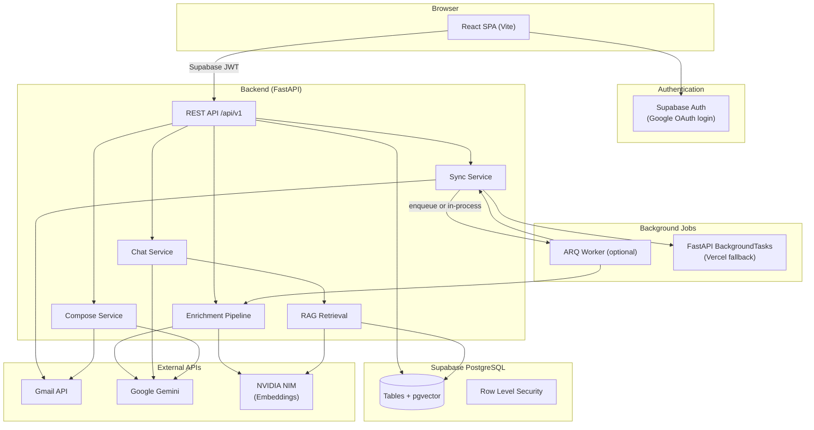
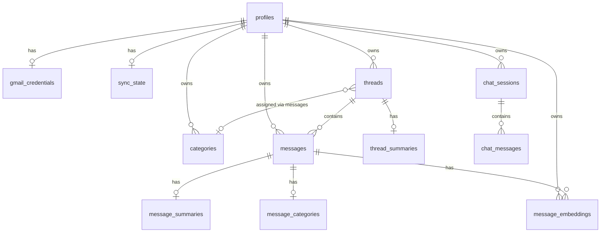

# Architecture & Design Document

**Gmail Intelligence Platform** — Repeatless Technical Assessment  
**Author:** Nunugoppula Ajay Kumar  
**Repository:** [ai-powered-gmail-intelligence](https://github.com/ajay-nunugoppula/ai-powered-gmail-intelligence)

---

## 1. System Architecture

### Overview

The platform is a three-tier application: a React SPA talks to a FastAPI backend, which orchestrates Gmail, Supabase, and external AI APIs. Long-running work (Gmail sync, AI enrichment) runs as background jobs — either in-process (Vercel serverless) or via an ARQ worker when Redis is available.



### Request flows

| Flow | Path |
|------|------|
| **Login** | User signs in via Supabase Google OAuth → frontend stores session JWT → all API calls send `Authorization: Bearer <token>` → backend validates JWT (HS256/ES256) |
| **Gmail connect** | User clicks Connect → backend Gmail OAuth → encrypted refresh token stored in `gmail_credentials` |
| **Sync** | `POST /sync/start` → background job lists/fetches Gmail messages → parses & upserts `threads` + `messages` → updates `sync_state.history_id` |
| **Enrichment** | Auto-starts after sync (or manual trigger) → per message: Gemini summarize + categorize → NVIDIA NIM embed chunks → Gemini thread summary |
| **Chat** | User message → embed query (NIM) → hybrid retrieval (pgvector + category + text) → Gemini answer with citation rules → store `chat_messages` with citations |
| **Compose/Reply** | Gemini draft from thread context → user edits → Gmail API send → message persisted locally |

### Deployment topology

| Component | Default (assessment demo) | Production scale-up |
|-----------|---------------------------|---------------------|
| Frontend | Vercel (`frontend/`) | Same |
| API | Vercel serverless (`backend/api/index.py`) | Railway / Fly.io for longer timeouts |
| Worker | In-process (`USE_ARQ_WORKER=false`) | Railway + Redis + ARQ |
| Database | Supabase hosted Postgres | Same |

---

## 2. Database Schema

Full DDL: [`supabase/migrations/001_initial.sql`](supabase/migrations/001_initial.sql)

### Entity relationship (simplified)



### Tables

| Table | Purpose |
|-------|---------|
| `profiles` | Extends `auth.users` — email, avatar, `gmail_connected` flag |
| `gmail_credentials` | Fernet-encrypted Gmail refresh token + scopes |
| `sync_state` | `history_id`, sync status, `progress_json` (sync + enrichment progress) |
| `categories` | Per-user labels (6 system categories seeded on signup) |
| `threads` | First-class conversation entity — subject, participants, `thread_summary`, category |
| `messages` | Individual emails — body, headers, Gmail IDs, read state |
| `message_summaries` | AI per-message summary (Gemini) |
| `thread_summaries` | AI rolled-up thread summary (Gemini) |
| `message_categories` | AI classification with confidence score |
| `message_embeddings` | Chunked text + 1024-dim vector for RAG |
| `chat_sessions` | Conversation threads for the AI assistant |
| `chat_messages` | User/assistant messages with `citations` JSONB |
| `sync_jobs` | Audit log of background job runs |

### Indexes

| Index | Rationale |
|-------|-----------|
| `idx_threads_user_last_message` | Inbox list sorted by recency |
| `idx_threads_user_category` | Sidebar category filters |
| `idx_messages_user_received` | Date-range queries |
| `idx_messages_from_email` | Sender-based search |
| `idx_message_embeddings_vector` (HNSW, cosine) | Fast approximate nearest-neighbor for RAG |
| `idx_chat_sessions_user` | Chat history sidebar |

### Data modeling decisions

1. **Threads are first-class** — Gmail thread ID maps to `threads`; UI, summaries, categories, and chat citations all anchor to threads, not isolated messages.

2. **Normalized AI outputs** — Summaries, categories, and embeddings live in separate tables so enrichment can be incremental (only process messages missing AI fields).

3. **Enrichment progress in `sync_state.progress_json`** — Avoids a new table; nested `enrichment` object tracks phase (`summarize` → `categorize` → `embed` → `thread_summaries`).

4. **Encrypted tokens at app layer** — Gmail refresh tokens are Fernet-encrypted before insert; Supabase service role is backend-only.

5. **RLS on every table** — `auth.uid() = user_id` (or join-based policies) enforces multi-tenant isolation.

### pgvector usage

| Aspect | Detail |
|--------|--------|
| **Model** | `nvidia/nv-embedqa-e5-v5` via NVIDIA NIM |
| **Dimensions** | 1024 |
| **What is embedded** | Overlapping text chunks (~400 chars, 50 overlap) from `body_text` (fallback: subject) |
| **Metadata** | `subject`, `from_email` stored in `metadata` JSONB per chunk |
| **Query vs passage** | `input_type=passage` at index time; `input_type=query` at search time (E5-style asymmetric retrieval) |
| **Search** | `match_message_embeddings()` SQL function — cosine distance, user-scoped, threshold filter |

**Why chunk?** Long emails exceed embedding context limits and dilute semantic signal. Chunking improves recall for specific facts buried deep in a message.

---

## 3. AI Design

### 3.1 Email summarization

**Per-message** (`gemini.summarize_message`):
- Input: subject, sender, body (clipped to 12,000 chars)
- Prompt: 2–3 sentences focusing on action items, deadlines, key facts
- Model: `gemini-2.0-flash` (configurable via `GEMINI_MODEL`)
- Temperature: 0.2

**Per-thread** (`gemini.summarize_thread`):
- Runs after all messages in affected threads are summarized
- Input: thread subject + bullet list of message summaries (not full bodies)
- Output: 3–5 sentence thread overview

**Long thread strategy:** The system does **not** send full thread bodies to Gemini for thread summaries. Instead it uses a **map-reduce** pattern: summarize each message first, then roll up summaries. This keeps token usage bounded and avoids context-window overflow on long conversations.

### 3.2 Categorization

- Gemini classifies each message into one of the user's category slugs (JSON output: `slug` + `confidence`)
- Thread category is derived from the latest categorized message (`assign_thread_category`)
- Sidebar filters operate on thread-level category

### 3.3 RAG pipeline (chat agent)

```
User question
    │
    ├─► Embed query (NVIDIA NIM, input_type=query)
    │       └─► pgvector similarity search (top 20, threshold 0.38)
    │
    ├─► Category hint retrieval (keyword → slug → recent messages in category)
    │
    └─► PostgreSQL text search (keyword extraction + ILIKE on subject/body/sender)
            │
            ▼
    Merge + dedupe by message_id (keep highest similarity)
            │
            ▼
    Refine: keyword filter (if only vector hits), similarity cutoff, cap at 8 chunks
            │
            ▼
    Number chunks [1]..[n] → Gemini prompt with strict citation rules
            │
            ▼
    Parse [n] citations from response → store in chat_messages.citations
```

**No separate reranker model** — refinement uses:
- Relative similarity cutoff (within 0.12 of top score)
- Keyword overlap filter when vector-only results
- Deduplication (one chunk per message, best score wins)

### 3.4 Source clarity across multiple emails

1. **Numbered context blocks** — Each retrieved chunk is labeled `[1]`, `[2]`, … with subject, sender, date, and excerpt in the prompt.
2. **Inline citation requirement** — Prompt instructs Gemini to cite `[n]` only for excerpts actually used.
3. **Post-processing** — `_parse_cited_indices()` extracts `[1]`, `[2]` from the response; only matching chunks become UI citations.
4. **Clickable sources** — Frontend `CitationList` links citations to `thread_id` for one-click navigation.
5. **Fallback** — If no `[n]` markers found, top 3 chunks are shown as sources (conservative default).

### 3.5 NVIDIA NIM model choice

| Setting | Value |
|---------|-------|
| Model | `nvidia/nv-embedqa-e5-v5` |
| Role | **Embeddings only** — not used for chat, summarization, or categorization |

**Why this model?**
- Purpose-built for retrieval QA (E5 family) with separate query/passage encoding
- 1024 dimensions — good balance of quality and index size
- Available on NVIDIA NIM free tier with OpenAI-compatible `/embeddings` API
- Strong performance on semantic email search without running a local GPU

**Gemini** handles all generative tasks (summarize, categorize, chat, compose) because it excels at structured JSON output and long-context reasoning at low latency.

### 3.6 Hallucination prevention

| Guardrail | Implementation |
|-----------|----------------|
| Retrieval-only answers | Prompt: "Answer using only the excerpts…" |
| Explicit uncertainty | Prompt: "If excerpts do not contain enough information, say so" |
| No invented metadata | Prompt: "Do not invent senders, dates, or email content" |
| Low temperature | 0.2 for generation, 0.0 for JSON categorization |
| Indexed-inbox check | Chat blocked with clear message if zero embeddings exist |
| Citation filtering | Only cited chunks exposed as sources |
| Compose guardrails | "Do not invent facts not supported by the thread" |

---

## 4. Gmail API Strategy

### Initial sync vs incremental sync

| Mode | Trigger | Mechanism |
|------|---------|-----------|
| **Initial** | First sync or missing/invalid `history_id` | `messages.list` with query `after:{SYNC_DAYS_BACK}` (default 90 days), paginated |
| **Incremental** | Subsequent syncs | `history.list` with `startHistoryId`, `historyTypes=messageAdded` |
| **Fallback** | `history.list` returns 404 | History ID expired → full initial sync |

After every successful sync, `users.getProfile` refreshes `history_id` for the next incremental run.

### Pagination

- **List phase:** `messages.list` / `history.list` with `pageToken`, up to 100 IDs per page
- **Cap:** `SYNC_MAX_MESSAGES` (default 1000) total messages per sync run
- **Fetch phase:** Each new message ID fetched individually via `messages.get(format=full)`
- **Skip known IDs:** In-memory set of already-synced Gmail message IDs avoids redundant fetches

### Rate limiting & quota handling

`GmailRateLimiter` (`gmail/rate_limiter.py`):

| Mechanism | Detail |
|-----------|--------|
| Proactive throttle | Token-bucket style — default 10 requests/second (`GMAIL_REQUESTS_PER_SECOND`) |
| 429 retry | Exponential backoff: 1s, 2s, 4s, 8s, 16s (max 5 retries) |
| Non-blocking API | Sync runs in background thread / ARQ — HTTP returns immediately with job status |
| Progress streaming | `sync_state.progress_json` updated every 10 messages or 2 seconds |

**Not implemented (trade-off):** Gmail Push notifications (Pub/Sub watch) — polling/manual/auto-interval sync instead.

---

## 5. Tool & Technology Decisions

| Choice | Justification |
|--------|---------------|
| **React 19 + TypeScript + Vite** | Type-safe UI, fast HMR, first-class Vercel deployment |
| **Tailwind CSS + shadcn/ui** | Accessible components, consistent design system, minimal custom CSS |
| **TanStack Query** | Server-state caching, optimistic chat updates, live polling during sync |
| **FastAPI** | Async-ready, automatic OpenAPI docs, excellent Python AI ecosystem |
| **Supabase** | Required stack piece — Auth + Postgres + RLS + pgvector in one service |
| **Google Gemini** | Summarization, categorization, chat, compose — strong JSON mode, low latency |
| **NVIDIA NIM (embeddings)** | Meets assignment requirement for NVIDIA model; dedicated retrieval embeddings |
| **pgvector (HNSW)** | Vector search co-located with relational data — no separate vector DB to operate |
| **ARQ + Redis** | Lightweight Python-native job queue for sync/enrichment when Redis available |
| **Fernet encryption** | Simple, auditable application-layer encryption for OAuth refresh tokens |
| **Vercel** | Zero-config frontend + serverless API for assessment demo |

---

## 6. Trade-offs & Limitations

### Deliberately simplified

| Area | Decision |
|------|----------|
| Sync window | Capped at 90 days / 1000 messages — reliable for demo, not full mailbox history |
| Attachments | Not parsed or indexed |
| Gmail push | Polling + manual/auto sync (every 3 min while tab open) — no Pub/Sub watch |
| Streaming chat | Full response returned at once — no SSE token streaming |
| Reranking | Heuristic cutoff instead of cross-encoder reranker |
| Multi-user scale | Single Supabase project, no sharding |
| OAuth consent | Google "Testing" mode — evaluators must be added as test users |
| Vercel timeouts | Long syncs may hit serverless limits — mitigated by `SYNC_DAYS_BACK=7` in production |

### With more time

1. **Gmail Pub/Sub watch** — real-time incremental sync without polling
2. **Dedicated worker service** — Railway/Fly for unconstrained sync + enrichment duration
3. **Cross-encoder reranking** — improve RAG precision on ambiguous queries
4. **SSE streaming** — token-by-token chat responses
5. **Attachment extraction** — PDF/text parsing and embedding
6. **Batch embedding API** — reduce NIM API calls for large inboxes
7. **OAuth verification** — production Google consent screen
8. **E2E test suite** — Playwright for critical flows
9. **Observability** — structured logging, job metrics, Gemini/NIM cost tracking

---

## Appendix: API surface

| Route group | Key endpoints |
|-------------|---------------|
| Auth | `GET /auth/gmail/connect`, `GET /auth/gmail/callback` |
| Sync | `POST /sync/start`, `GET /sync/status` |
| Enrichment | `POST /enrichment/start`, `GET /enrichment/status` |
| Threads | `GET /threads`, `GET /threads/{id}` |
| Compose | `POST /compose/draft`, `POST /compose/send` |
| Chat | `GET/POST /chat/sessions`, `POST /chat/sessions/{id}/messages` |
| Config | `GET /config` (public sync/enrichment settings) |

Interactive docs: `GET /docs` on the backend URL.
